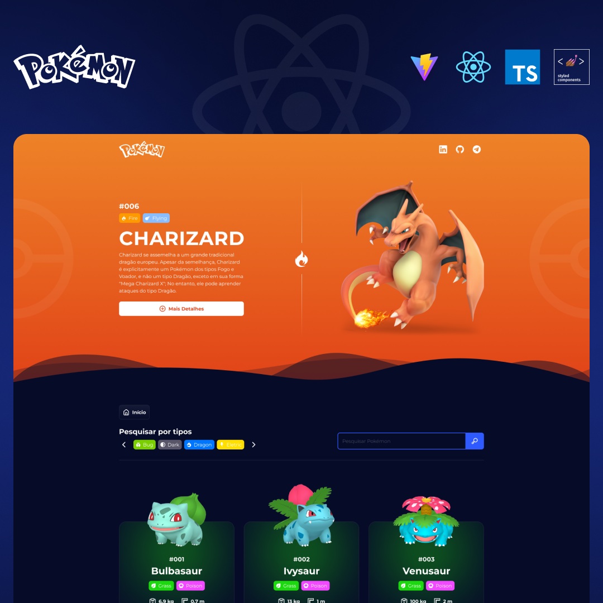

# Pokédex — React + TypeScript

Uma Pokédex moderna construída com **React**, **TypeScript** e **Vite**, consumindo a **PokéAPI**. O projeto foca em **performance** (lazy loading e paginação), **usabilidade** (filtros, busca e responsividade) e **robustez** (validação de formulário e dos dados recebidos da API).



## ✨ Demonstração

- **Deploy:** [https://pokedex-react-carlosdancr.vercel.app/](https://pokedex-react-beta-ten.vercel.app/)

## 🔎 Funcionalidades

- **Busca por nome ou ID** do Pokémon  
- **Filtro por tipo** (ex.: Fire, Water, Grass, etc.)
- **Paginação** de resultados
- **Lazy Loading** para otimizar carregamento
- **Layout responsivo** (mobile-first)
- **Validação de formulário** (inputs e estados de erro)
- **Validação de dados da API** (tratamento de respostas inesperadas)

## 🧰 Tecnologias

- **React** + **TypeScript**
- **Vite** (dev server e build)
- **Styled-components** (estilização e estilos condicionais)
- **MUI** (componentes de UI; paginação)
- **PokéAPI** (fonte de dados)

> Não há necessidade de chave de API para a PokéAPI.

## 📦 Pré-requisitos

- **Node.js 18+** (recomendado)
- **npm** ou **Yarn** instalado

## 🚀 Como executar localmente

```bash
# 1) Clone o repositório
git clone https://github.com/carlosdancr/pokedex-react.git
cd pokedex-react

# 2) Instale as dependências
# Usando npm
npm install
# ou usando Yarn
yarn

# 3) Inicie o servidor de desenvolvimento
# npm
npm run dev
# Yarn
yarn dev
```

O Vite exibirá no terminal o endereço local (por padrão, algo como `http://localhost:5173`).

## 🏗️ Build de produção

```bash
# Gerar build
npm run build
# ou
yarn build

# Pré-visualizar a build localmente
npm run preview
# ou
yarn preview
```

Os arquivos gerados ficarão em `dist/`.

## 📱 Responsividade

Interface adaptável a diferentes tamanhos de tela (mobile, tablet e desktop), garantindo navegação fluida e toques/scroll adequados.

## ⚡ Performance

- **Lazy Loading** para adiar carregamento do que não está em viewport.
- **Paginação** para reduzir payload e melhorar TTFB e interatividade.

## 🧭 Estrutura (resumo)

Sem assumir detalhes específicos, a organização típica inclui:

```
src/
  components/    # componentes reutilizáveis (cartões, inputs, etc.)
  pages/         # páginas/rotas principais
  services/      # clientes e funções de acesso à API
  hooks/         # hooks customizados
  styles/        # temas e estilos globais
  utils/         # helpers e mapeamentos (tipos, normalizadores)
```

> Os nomes exatos podem variar; consulte o diretório `src/` para a estrutura final.

## 🔗 Endpoints & dados

- **PokéAPI** — https://pokeapi.co  
  Exemplos de uso comuns incluem listar pokémons com paginação e obter detalhes por **nome** ou **ID**.

## 🤝 Como contribuir

1. Faça um fork do repositório
2. Crie uma branch de feature: `git checkout -b feat/minha-feature`
3. Commit suas alterações: `git commit -m "feat: minha feature"`
4. Push na branch: `git push origin feat/minha-feature`
5. Abra um Pull Request 🙌

## 📝 Licença

Se houver um arquivo `LICENSE`, a licença definida ali se aplica. Caso contrário, considere adicionar uma (ex.: MIT).

---

## 🙌 Créditos

Projeto criado por [@carlosdancr](https://github.com/carlosdancr).


